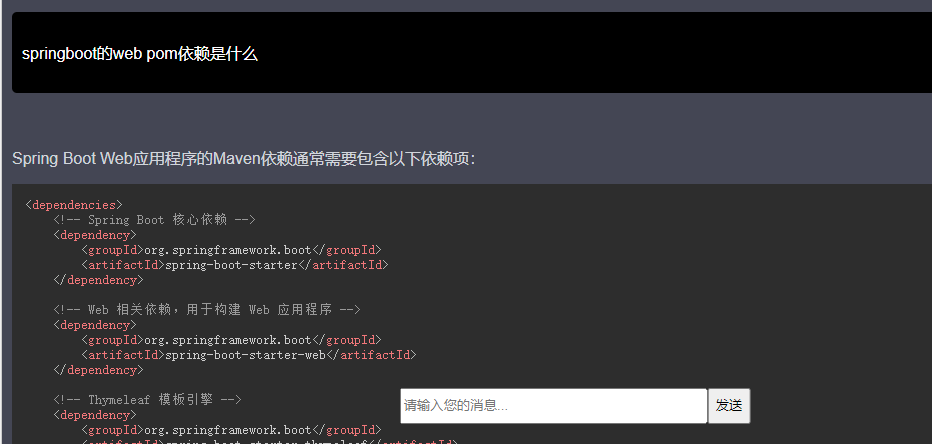
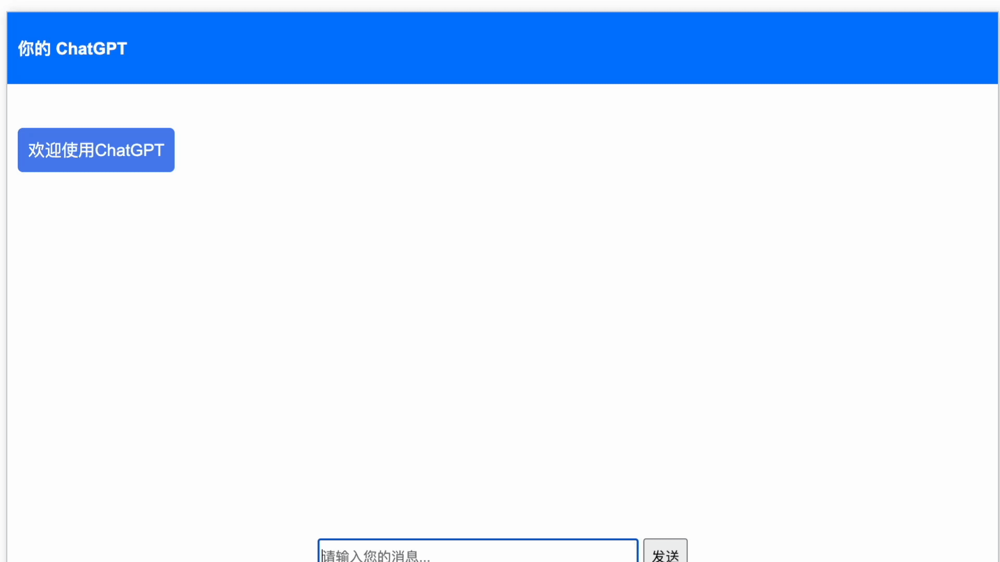
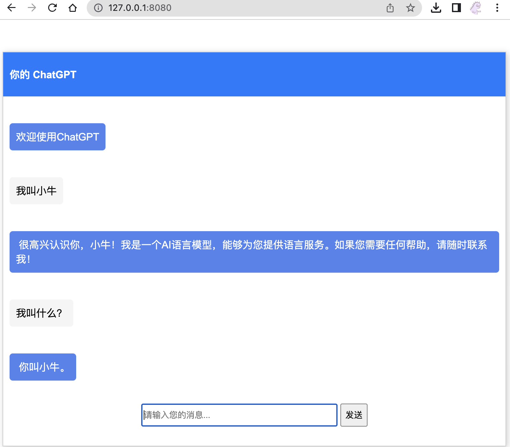

## 🔥你的chatgpt🔥

OpenAi最简洁的Java流式返回接入方式，方便接入业务系统，没有第三方依赖，只需要使用Spring Boot即可！轻松构建你的带有聊天记忆、画图功能的chatgpt，支持代码块高亮、markdown语法！
- 模型：gpt-3.5-turbo / gpt-4

GitHub仓库：[https://github.com/NiuXiangQian/chatgpt-stream](https://github.com/NiuXiangQian/chatgpt-stream)

## 特点

* 无第三方依赖
* 流式返回
* 有聊天记忆
* 画图

采用sse技术，感兴趣的可以先了解一下

### 👀效果
非专业前端，样式略丑
* 最新效果

* 最初版本



### 时间轴
- 2023-06-16 健壮性优化，规范化数据返回，优化sse接口业务上的异常处理。
             增加html中sse的post请求方式，参考：[index_post.html](src%2Fmain%2Fresources%2Fstatic%2Findex_post.html)
- 2023-04-02 更换为vue渲染更加便捷，加入代码块高亮、表格markdown语法支持
- 2023-04-01 优化样式、修复聊天记忆bug
- 2023-03-29 使用netty提高并发能力
- 2023-03-23-下午 增加了聊天记忆、画图功能
- 2023-03-23 上午 第一版最简易版本demo，此版本代码在`original-simplicity`分支里
### 重要配置

```yaml
authorization: 你的key
```
申请地址：https://platform.openai.com/

### 关于中国大陆访问不通问题

* 使用vpn代理
    - 此功能已经实现 请查看 OpenAiWebClient.java 配置好代理ip和端口即可
    ```java
  
  HttpClient httpClient = HttpClient.create()
            .secure(sslContextSpec -> sslContextSpec.sslContext(finalSslContext))
            .tcpConfiguration(tcpClient -> tcpClient.proxy(proxy ->
                proxy.type(ProxyProvider.Proxy.HTTP).host("127.0.0.1").port(7890)));
  
    ```
* 部署到海外
    - 取消如下配置即可
  ```yaml
    env: test
    ```

### 启动

启动springboot 然后访问 http://127.0.0.1:8080/

### 便于接入自己的业务系统

只需要稍微扩展如下接口，即可接入自己的业务系统将消息入库、记录....
```java
public interface CompletedCallBack {

    /**
     * 成功完成回调用
     */
    void completed(Message questions, String sessionId, String response);

    /**
     * 失败回调
     */
    void fail(Message questions, String sessionId, String response);
}
```

### 后续功能

- [X] 流式返回
- [X] 聊天记忆
- [X] 图片接入
- [ ] ....

### 交流方式

有问题可以提交issue，有想法也可以提交pr，欢迎大家

如果对你有帮助还请帮忙给个star，谢谢！
